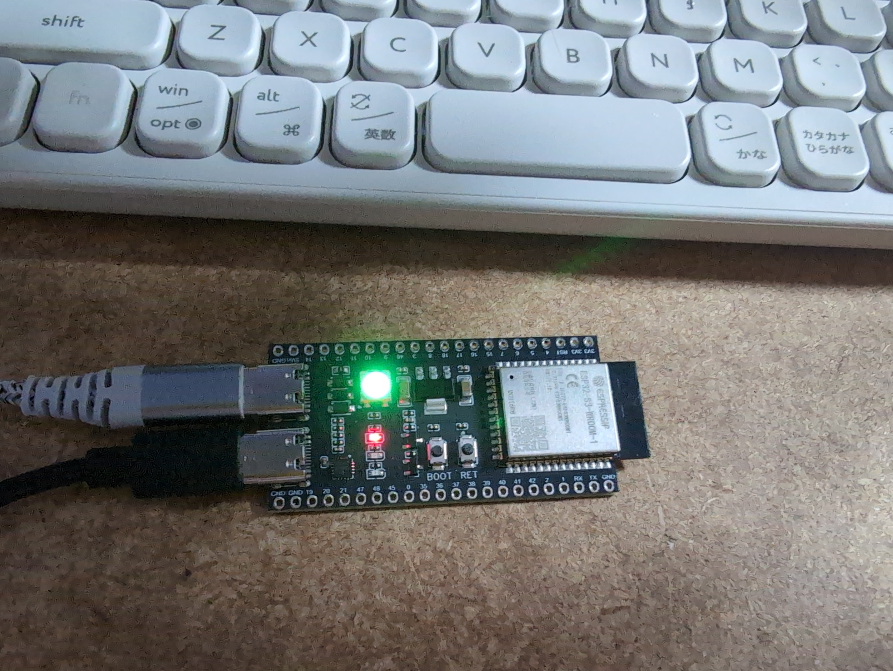

# BLE2USBpie

ESP32-S3にBLE接続したキーボードからHID入力を受け取り、親指シフト打鍵をローマ字打鍵に変換して、USB接続したPCへ出力するアプリです。キーボードでマウスカーソルをドット単位で操作するモードも備えています。

ESP32-S3-WROOM1搭載の開発用ボードで実装しました。開発時に使ったキーボードはELECOM TK-CM10BMKIVですが、BLE対応なら接続可能でしょう。

## 使い方

接続後、通常モード、親指シフトモード、マウスモードの３種類のモードがあります。

### 接続

1. BLEキーボードをペアリングモードにする。(TK-CM10BMKIVではFn+Tabを長押し)
2. PCとESP32-S3をUSBケーブルで接続。LEDがゆっくり青色点滅する。
3. ESP32-S3は起動直後にキーボードデバイスをスキャンし、最初に見つかった機器とペアリングします。ペアリング成功すると、緑に常時点灯します。

BLEキーボードが節電状態になり接続が切れるとLEDが赤色の点滅になります。何かキーを押すと再接続してLEDが緑の点滅に戻ります。長時間放置したときなど再接続に失敗することがありますが、そのときはBLEキーボードをペアリングモードにし、ESP32-S3のRSTボタンを押して接続処理を最初からやり直してください。

### 通常モード

1. LEDは緑の常時点灯。キー入力はそのままUSBに出力します。
2. [ひらがな]キーで親指シフトモードになります。
3. [prtsc]キーでマウスモードになります。

### 親指シフトモード

1. LEDは明るめの黄色の常時点灯。親指シフトキー入力をローマ字に変換してUSBに出力します。
2. 左親指シフトは[無変換]キー、右親指シフトは[変換]キーです。
3. [Caps]キーで通常モードに戻ります。モードがIMEとズレた場合は、何度か押すとそのうち合います。
4. 親指シフト判定ロジックは[ENICOLA配列規格書](http://nicola.sunicom.co.jp/spec/kikaku.htm?fbclid=IwY2xjawUbJMhwZG9mBWV4dG4DYWVtAjEwAGJyaWQRMUlkOGU1RHFNSlR6bFpvbGFzcnRjBmFwcF9pZBAyMjIwMzkxNzg4MjAwODkyAAEeMopsu0Qo3N7O_VOa9-W_iwuZDCPb_Ux99x8JGOTqfV9976pkORqU1S05QSg_aem_nWrI8W7LLH0CEXNBPkGXLQ)よりも簡略化されています。物凄く早く打鍵するとおかしなことがあるかもしれませんが、私自身が打鍵する分には特に支障はありませせん。

親指シフトについては[日本語入力コンソーシアム](http://nicola.sunicom.co.jp/info2.html)を参照してください。

### マウスモード

キーボードからマウスカーソルを操作するモードです。ドット単位でマウスカーソルを動かしたいときに。

1. LEDは黄色の高速点滅。
2. 操作キーは以下のとおり。[prtsc]キーで通常モードに戻ります。

|キー|操作|
|----|----|
|F1|左クリック|
|F2|ホイールクリック|
|F3|右クリック|
|F5|ホイールダウン|
|F6|ホイールアップ|
|F9|カーソル←|
|F10|カーソル↓|
|F11|カーソル↑|
|F12|カーソル→|

## ビルド方法

Arduino IDEで本プロジェクトを開き、対象のボードとしてESP32S3 Dev Moduleを選択してビルドしてください。ビルドには以下のライブラリが必要です。

- NimBLE-Arduino 2.5.1
- Adafruit_NeoPixel 1.15.5

## ライセンス

GPL-3.0
